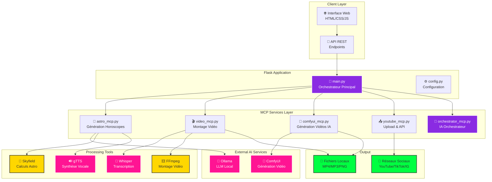

# AstroGenAI 🌌✨

> **Générateur de contenu astrologique intelligent** - Pipeline complet de création automatisée d'horoscopes, cartes du ciel et vidéos pour réseaux sociaux, propulsé par l'IA.

[](https://python.org)
[](https://flask.palletsprojects.com)
[](LICENSE)
[](https://ollama.com)

---

## 🚀 Vue d'Ensemble

AstroGenAI est une plateforme complète qui automatise la création de contenu astrologique de qualité professionnelle. De la génération d'horoscopes personnalisés à la production de vidéos prêtes pour YouTube, TikTok et Instagram, tout est orchestré par une intelligence artificielle avancée.

### ✨ Fonctionnalités Clés

🔮 **Horoscopes Intelligents** - Génération d'horoscopes basés sur des calculs astronomiques réels (Skyfield) et des modèles de langage (Llama, Mistral)

🗺️ **Cartes du Ciel** - Calcul et visualisation des positions planétaires exactes pour n'importe quelle date

🎬 **Production Vidéo Automatisée** - Pipeline complet : Texte → Audio → Vidéo → Montage → Upload

🤖 **Chat Astral IA** - Assistant conversationnel expert en astrologie

📱 **Multi-Plateformes** - Formats optimisés pour YouTube Shorts, TikTok, Instagram Reels

🎵 **Montage Professionnel** - Synchronisation audio/sous-titres, mixage musical, effets visuels

---

## 🏗️ Architecture Système



### 🔄 Workflow Principal

1. **Interface Web** → Requête utilisateur (signe, date, format)
2. **Orchestrateur IA** → Planification intelligente du workflow
3. **Services MCP** → Exécution parallèle/séquentielle des tâches
4. **Génération** → Horoscope (texte) + Audio (TTS) + Vidéo (ComfyUI)
5. **Montage** → Synchronisation audio/sous-titres + Effets + Musique
6. **Distribution** → Upload automatique sur plateformes sociales

---

## 🛠️ Installation & Configuration

### Prérequis Système

- **Python 3.10+**
- **Node.js** (optionnel, pour outils de développement)
- **FFmpeg** (obligatoire pour montage vidéo)
- **Git**

### Installation Rapide

```bash
# 1. Cloner le projet
git clone https://github.com/votre-username/astrogenai.git
cd astrogenai

# 2. Environnement virtuel
python -m venv venv
source venv/bin/activate  # Linux/Mac
# ou: venv\Scripts\activate  # Windows

# 3. Dépendances Python
pip install -r requirements.txt

# 4. Configuration
cp .env.example .env
# Éditer .env avec vos paramètres

# 5. Installation des services IA
# Ollama
curl -fsSL https://ollama.com/install.sh | sh
ollama pull llama3.1:8b-instruct-q8_0
ollama pull mistral:7b-instruct

# 6. Lancement
python main.py
```

### Configuration Avancée

#### Variables d'Environnement (.env)

```env
# === CONFIGURATION FLASK ===
DEBUG=True
HOST=0.0.0.0
PORT=5000

# === SERVICES IA ===
OLLAMA_BASE_URL=http://127.0.0.1:11434
COMFYUI_SERVER=127.0.0.1:8188

# === MODÈLES ===
OLLAMA_TEXT_MODEL=mistral:7b-instruct
OLLAMA_CHAT_MODEL=llama3.1:8b-instruct-q8_0

# === AUTHENTIFICATION (Optionnel) ===
AUTH_ENABLED=False
AUTH_USERNAME=admin
AUTH_PASSWORD=your-secure-password
```

#### Configuration YouTube API

```bash
# 1. Créer un projet Google Cloud
# 2. Activer YouTube Data API v3
# 3. Créer des identifiants OAuth 2.0
# 4. Télécharger credentials.json

# 5. Placer dans le projet
mkdir -p astro_core/services/youtube
cp ~/Downloads/credentials.json astro_core/services/youtube/

# 6. Première authentification
python astro_core/services/youtube/youtube_auth.py
```

---

## 🎯 Utilisation

### Interface Web

Accédez à `http://localhost:5000` pour l'interface principale :

- **🔮 Horoscope Individuel** - Génération personnalisée
- **📅 Horoscopes Quotidiens** - Batch pour tous les signes
- **🌌 Carte du Ciel** - Visualisation astronomique
- **🤖 Chat IA** - Assistant astrologique
- **🎬 Générateur Vidéo** - Production de contenu

### API REST

#### Endpoints Principaux

```http
# Horoscopes
POST /api/generate_single_horoscope
POST /api/generate_daily_horoscopes

# Vidéos
POST /api/comfyui/generate_video
POST /api/workflow/complete_sign_generation

# Chat IA
POST /api/ollama/chat

# Système
GET /health
```

#### Exemple d'Utilisation API

```python
import requests

# Générer un horoscope
response = requests.post('http://localhost:5000/api/generate_single_horoscope', 
    json={'sign': 'aries', 'date': '2024-12-21'})

result = response.json()
print(result['result']['horoscope_text'])
```

### Ligne de Commande

```bash
# Tests système
python main.py test

# Configuration actuelle
python main.py config

# Nettoyage des données
python scripts/purge_data.py
```

---

## 📁 Structure du Projet

```
astrogenai/
├── 📄 main.py                 # Serveur Flask principal
├── ⚙️ config.py              # Configuration centralisée
├── 📋 requirements.txt       # Dépendances Python
├── 🌐 templates/             # Templates HTML
├── 🎨 static/                # CSS, JS, images statiques
├── 🧠 astro_core/            # Services MCP
│   ├── services/
│   │   ├── 🔮 astro_mcp.py           # Génération horoscopes
│   │   ├── 🎬 video_mcp.py           # Montage vidéo
│   │   ├── 🎨 comfyui_mcp.py         # Génération vidéo IA
│   │   ├── 📤 youtube_mcp.py         # Upload YouTube
│   │   ├── 🧠 orchestrator_mcp.py    # IA Orchestrateur
│   │   └── 🌟 astrochart/            # Calculs astronomiques
├── 📂 assets/                # Ressources (images, musique)
├── 📂 output/                # Fichiers générés
└── 🛠️ scripts/              # Outils de maintenance
```

---

## 🚀 Workflows Automatisés

### Workflow Simple : Horoscope + Audio

```python
# Génération automatique horoscope avec audio TTS
POST /api/generate_single_horoscope_with_audio
{
    "sign": "leo",
    "date": "2024-12-21",
    "generate_audio": true
}
```

### Workflow Complet : Production Vidéo

```python
# Pipeline complet : Texte → Audio → Vidéo → Montage
POST /api/workflow/complete_sign_generation
{
    "sign": "scorpio",
    "format": "youtube_short",
    "add_music": true
}
```

### Workflow Intelligent : Batch IA

```python
# Orchestration intelligente pour tous les signes
POST /api/agent/intelligent_batch
{
    "signs": ["aries", "taurus", "gemini"],
    "optimization_goals": ["quality", "speed"],
    "include_upload": true
}
```

---

## 🔧 Dépendances & Services

### Dépendances Python Critiques

```txt
flask>=2.3.0                 # Serveur web
ollama>=0.1.0                # Modèles de langage
openai-whisper>=20231117     # Transcription audio
skyfield>=1.46               # Calculs astronomiques
gtts>=2.4.0                  # Synthèse vocale
matplotlib>=3.7.0            # Génération graphiques
google-api-python-client     # API YouTube
fastmcp>=0.1.0              # Protocol MCP
```

### Services Externes

| Service | Port | Status | Description |
|---------|------|--------|-------------|
| **Ollama** | 11434 | 🟢 Requis | Modèles de langage locaux |
| **ComfyUI** | 8188 | 🟡 Optionnel | Génération vidéo IA |
| **YouTube API** | HTTPS | 🟡 Optionnel | Upload automatique |

### Outils Système

- **FFmpeg** : Montage vidéo (obligatoire)
- **Git** : Gestion de version
- **Python 3.10+** : Runtime principal

---

## 🧪 Tests & Développement

### Lancement en Mode Développement

```bash
# Mode debug avec rechargement automatique
FLASK_ENV=development python main.py

# Tests des services
python -c "
import requests
health = requests.get('http://localhost:5000/health').json()
print('Services:', health['services'])
"
```

### Tests de Santé

```bash
# Vérification complète du système
curl http://localhost:5000/health | jq .

# Test spécifique Ollama
curl http://localhost:5000/api/ollama/models

# Test génération horoscope
curl -X POST http://localhost:5000/api/generate_single_horoscope \
  -H "Content-Type: application/json" \
  -d '{"sign": "aries"}'
```

---

## 📈 Monitoring & Performance

### Métriques Système

L'endpoint `/health` fournit des informations détaillées :

```json
{
  "status": "healthy",
  "services": {
    "ollama": {"status": true, "models": 5},
    "astro": {"status": true},
    "comfyui": {"status": false},
    "video_generator": {"status": true},
    "orchestrator": {"status": true}
  },
  "version": "2.1.0"
}
```

### Optimisations Recommandées

- **Cache Ollama** : Précharger les modèles fréquents
- **Parallélisation** : Utiliser l'orchestrateur IA pour les workflows batch
- **Stockage** : Nettoyer régulièrement avec `scripts/purge_data.py`

---

## 🤝 Contribution & Support

### Contribution

1. **Fork** le projet
2. **Branch** feature (`git checkout -b feature/nouvelle-fonctionnalite`)
3. **Commit** (`git commit -am 'Ajout nouvelle fonctionnalité'`)
4. **Push** (`git push origin feature/nouvelle-fonctionnalite`)
5. **Pull Request**

### Signalement de Bugs

Utilisez les [GitHub Issues](https://github.com/votre-username/astrogenai/issues) avec :
- Description détaillée
- Logs de `/health`
- Configuration système
- Étapes de reproduction

### Feuille de Route

- [ ] **Tests unitaires** complets
- [ ] **Docker** containerisation
- [ ] **API externe** pour développeurs tiers
- [ ] **Templates vidéo** personnalisables
- [ ] **Multi-langues** (EN, ES, IT)
- [ ] **Base de données** pour historique
- [ ] **Authentification** avancée

---

## 📄 Licence

Ce projet est sous licence **MIT**. Voir [LICENSE](LICENSE) pour plus de détails.

---

## 🙏 Remerciements

- **[Ollama](https://ollama.com)** - Modèles de langage locaux
- **[ComfyUI](https://github.com/comfyanonymous/ComfyUI)** - Génération d'images/vidéos IA
- **[Skyfield](https://rhodesmill.org/skyfield/)** - Calculs astronomiques précis
- **[Flask](https://flask.palletsprojects.com)** - Framework web Python

---
